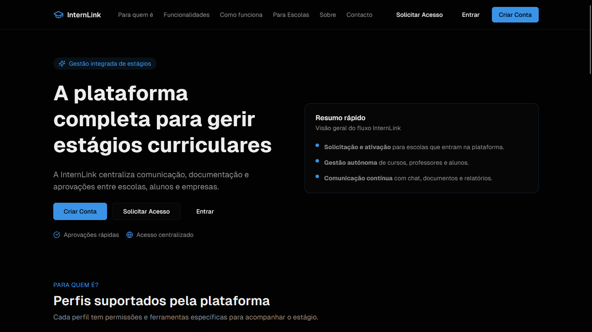
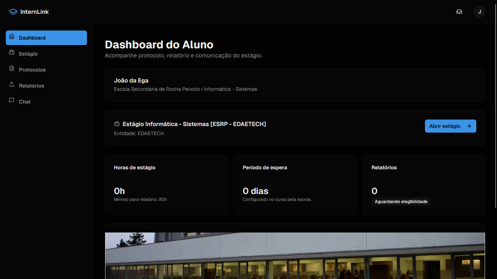
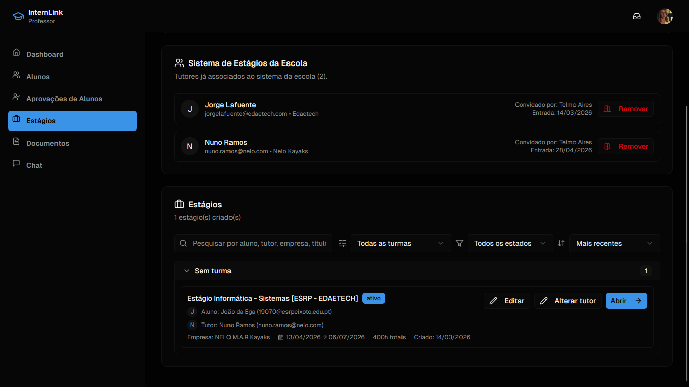
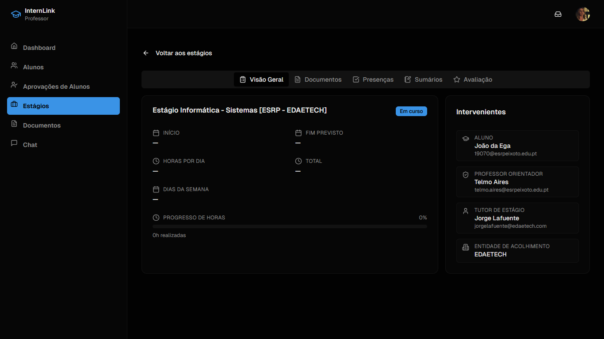
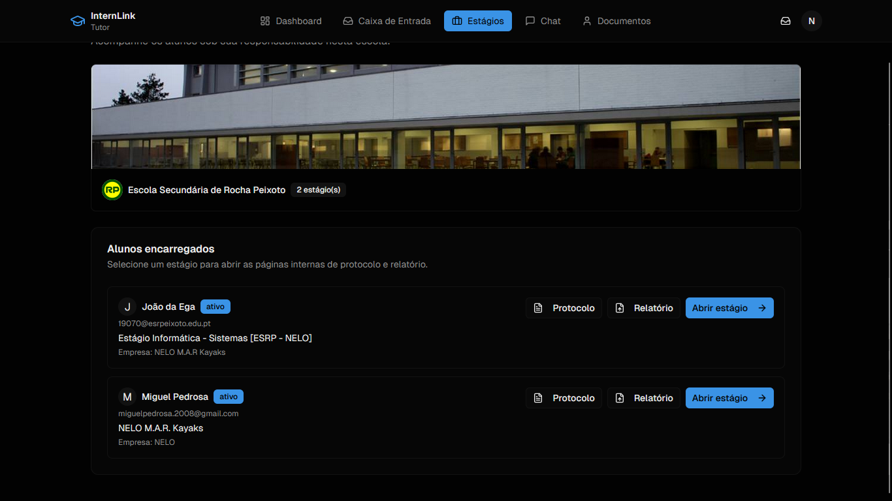
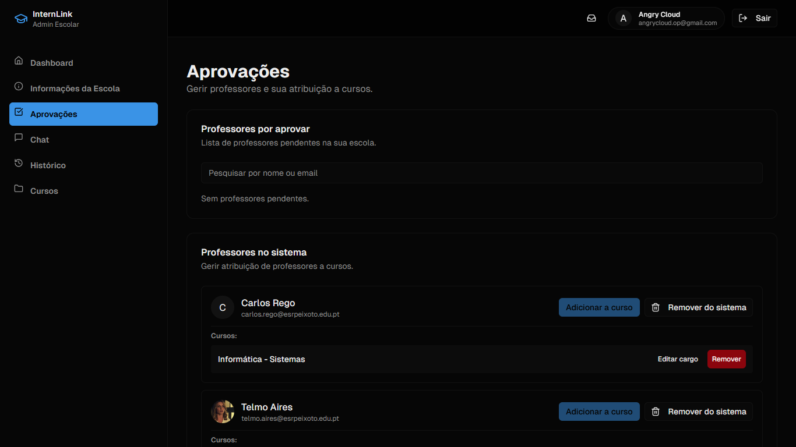
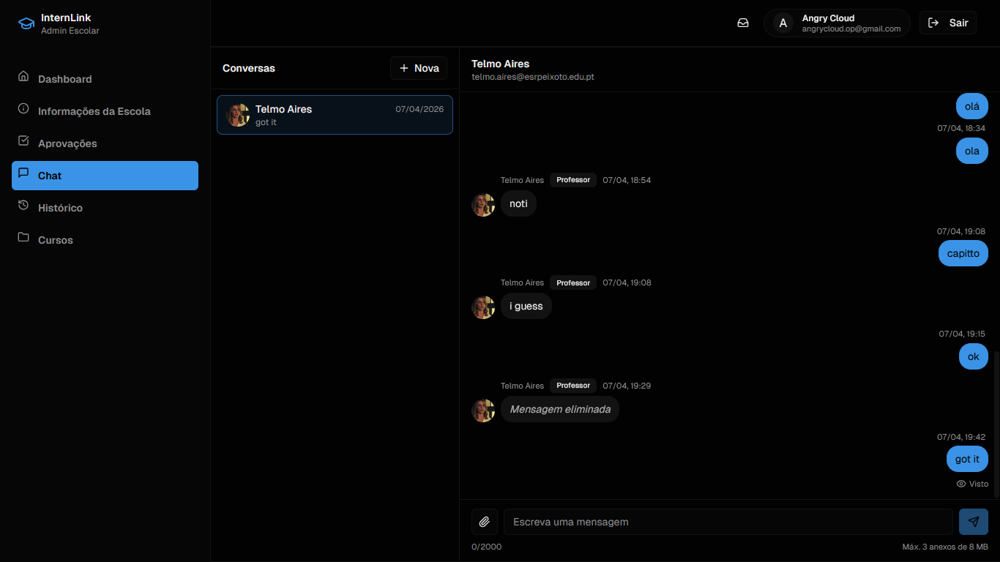
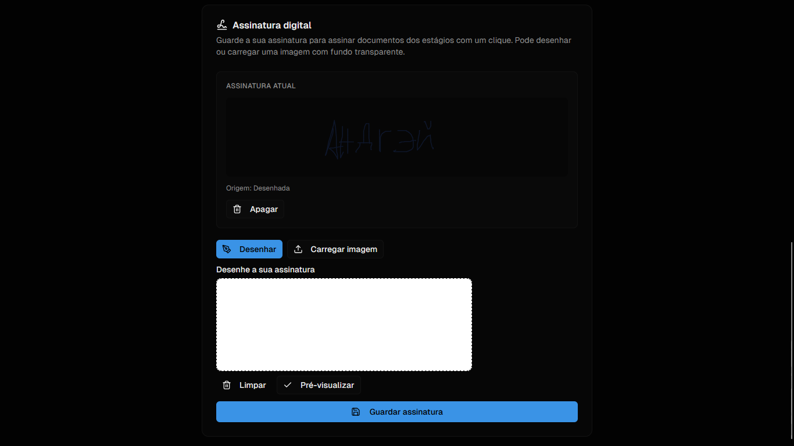

# InternLink

> Plataforma de gestão de estágios curriculares (FCT) para escolas secundárias e profissionais, desenvolvida em Next.js 16 + Firebase.

InternLink centraliza num único espaço toda a relação **escola ↔ aluno ↔ entidade acolhedora** ao longo do estágio: aprovação de contas, associação de cursos/turmas, gestão documental com assinaturas eletrónicas, comunicação em tempo real e painéis por perfil.

---

## Índice

- [1. Visão Geral](#1-visão-geral)
- [2. Arquitetura](#2-arquitetura)
- [3. Perfis de Utilizador e Permissões](#3-perfis-de-utilizador-e-permissões)
- [4. Módulo de Gestão de Estágios (FCT)](#4-módulo-de-gestão-de-estágios-fct)
- [5. Modelo de Dados](#5-modelo-de-dados)
- [6. Rotas e Endpoints](#6-rotas-e-endpoints)
- [7. Segurança](#7-segurança)
- [8. Capturas de Ecrã](#8-capturas-de-ecrã)
- [9. Setup Local](#9-setup-local)
- [10. Scripts e Migrations](#10-scripts-e-migrations)
- [11. Testes](#11-testes)
- [12. Deploy](#12-deploy)
- [13. Estrutura do Repositório](#13-estrutura-do-repositório)
- [14. Licença e Autoria](#14-licença-e-autoria)

---

## 1. Visão Geral

A aplicação modela o ciclo de vida completo de um estágio curricular:

1. **Onboarding** — registo de escola, cursos, professores, alunos e tutores externos, com fluxo de aprovação multi-nível (administrador escolar → professor responsável).
2. **Atribuição de estágio** — o professor cria o estágio, associa o aluno, o tutor externo e a entidade acolhedora, define datas, horas previstas e plano de atividades.
3. **Gestão documental** — geração automática dos 12 documentos canónicos do protocolo FCT a partir de templates PDF, com assinatura eletrónica posicional por perfil.
4. **Acompanhamento** — dashboards diferenciados por perfil, registo de horas, relatórios periódicos e chat em tempo real por canal.
5. **Encerramento** — consolidação documental, histórico imutável de versões e exportação final.

### Diferenciadores técnicos

- **Assinatura eletrónica posicional** por perfil: cada template define caixas `(page, x, y, width, height)` destinadas a cada role e o backend injecta as assinaturas com `pdf-lib`.
- **Versionamento imutável** de documentos em `estagios/{id}/documentos/{docId}/versoes`.
- **Claims customizadas** no Firebase Auth (`role`, `schoolId`, `status`) sincronizadas via Admin SDK.
- **Rules** do Firestore e Realtime Database auditáveis e cobertas por testes (`@firebase/rules-unit-testing`).

---

## 2. Arquitetura

```
┌─────────────────────────────────────────────────────────────────┐
│                          Next.js 16 (App Router)                │
│  ┌─────────────┐  ┌──────────────┐  ┌────────────────────────┐  │
│  │ React 18 UI │  │ Server Comps │  │ Route Handlers (/api)  │  │
│  │  Tailwind 4 │  │  + Actions   │  │  firebase-admin + jose │  │
│  └─────────────┘  └──────────────┘  └────────────────────────┘  │
└──────────────────────────┬──────────────────────────────────────┘
                           │  ID Token  ▲  Session Cookie (JWT)
                           ▼            │
┌─────────────────────────────────────────────────────────────────┐
│                         Firebase Platform                       │
│  Auth (custom claims) │ Firestore │ Realtime DB │ Cloud Storage │
└─────────────────────────────────────────────────────────────────┘
```

### Stack

| Camada | Tecnologia |
|---|---|
| Framework | Next.js 16 (App Router, RSC, Route Handlers) |
| UI | React 18, Tailwind CSS 4, Radix UI, shadcn/ui, `lucide-react` |
| Formulários / Validação | `react-hook-form` + `zod` |
| Autenticação | Firebase Auth + session cookies JWT (`jose`) |
| Base de dados (relacional leve) | Cloud Firestore |
| Dados em tempo real | Firebase Realtime Database (chat, presença) |
| Ficheiros | Firebase Cloud Storage |
| PDF | `pdf-lib` (manipulação), `pdfjs-dist` (preview) |
| Canvas (assinaturas, posicionamento) | `fabric` |
| Server runtime | `firebase-admin` (Admin SDK) |
| Anti-abuso | Google reCAPTCHA v3 |
| Observabilidade | `@vercel/analytics` |
| Testes | `vitest` + `@firebase/rules-unit-testing` |

---

## 3. Perfis de Utilizador e Permissões

| Perfil | Âmbito | Principais capacidades |
|---|---|---|
| **Administrador da Escola** (`school-admin`) | Uma escola | Gere cursos e turmas, aprova professores e alunos, gere pastas de documentos, consulta histórico. |
| **Diretor de Curso / Professor** (`professor`) | Um ou mais cursos | Aprova registos de alunos e tutores, cria estágios, associa tutores, carrega e assina documentos. |
| **Tutor externo** (`tutor`) | Empresa / entidade | Vê estágios à sua responsabilidade, consulta e assina protocolos/relatórios, comunica por chat. |
| **Aluno** (`aluno`) | Próprio estágio | Acede ao seu estágio, carrega/assina documentos permitidos, regista horas e participa no chat. |

A matriz canónica de permissões está em [`lib/estagios/permissions.ts`](./lib/estagios/permissions.ts) e define, por documento e por ação (ver, carregar, assinar, gerir acesso), os roles autorizados. As regras do Firestore ([`firestore.rules`](./firestore.rules)) replicam essa matriz no servidor.

---

## 4. Módulo de Gestão de Estágios (FCT)

O módulo FCT é o núcleo funcional da plataforma. Cada estágio é um documento em `estagios/{id}` e expõe quatro sub-áreas na UI (`components/estagios/`):

### 4.1. Overview
Resumo do estágio — aluno, curso, entidade, datas, horas previstas/realizadas, estado (ativo/concluído/cancelado), progresso documental e chat rápido.

### 4.2. Documentos canónicos
Ao criar um estágio, o backend faz seed de **12 documentos** a partir de [`lib/estagios/templates.ts`](./lib/estagios/templates.ts) (ex.: Protocolo de Estágio, Plano Individual, Registo Semanal de Horas, Avaliação do Tutor, Avaliação do Professor, Relatório Final…). Cada template define:

- `categoria` — agrupamento na UI.
- `accessRoles` — quem pode ler.
- `signatureRoles` — quem tem de assinar.
- `signatureBoxes` — coordenadas das caixas de assinatura por role, por página.

O Diretor de Curso pode ainda adicionar **documentos fora do catálogo** via `POST /api/estagios/[id]/documentos` (botão *Novo documento*).

### 4.3. Assinatura eletrónica
1. O utilizador desenha a assinatura (ou carrega PNG) em [`SignaturePad`](./components/estagios/signature-pad.tsx) e guarda-a no perfil (`users/{uid}.signatureDataUrl`).
2. Ao assinar um documento, o cliente envia o role pretendido para `POST /api/estagios/[id]/documentos/[docId]/assinar`.
3. O servidor valida a permissão, carrega a versão atual do PDF, desenha a assinatura nas caixas correspondentes a esse role com `pdf-lib`, guarda a nova versão em `estagios/{id}/documentos/{docId}/versoes/{n}` e atualiza o `currentVersion`.

### 4.4. Versões e histórico
Todas as escritas geram uma nova `versao` imutável (`fileUrl`, `filePath`, `notes`, `uploadedAt`, `uploadedBy`). O [`VersionHistoryDialog`](./components/estagios/documentos/version-history-dialog.tsx) permite abrir qualquer versão anterior.

### 4.5. Upload & caixas de assinatura
O [`UploadWizard`](./components/estagios/documentos/upload-wizard.tsx) é um wizard em três passos:
1. Upload do PDF.
2. Posicionamento visual das caixas de assinatura sobre o PDF (via `fabric` + `pdfjs-dist`).
3. Definição dos roles responsáveis por cada caixa.

---

## 5. Modelo de Dados

### Firestore (resumo)

```
users/{uid}                       # perfil, role, schoolId, status, signatureDataUrl
schools/{schoolId}                # metadados da escola
schools/{schoolId}/cursos/{id}    # cursos e turmas
schools/{schoolId}/folders/{id}   # pastas de documentos institucionais

pendingRegistrations/{uid}        # registos à espera de aprovação
tutorInvites/{id}                 # convites a tutores externos

estagios/{id}                     # estágio (aluno, tutor, professor, schoolId, datas, estado)
estagios/{id}/documentos/{docId}  # metadados do documento + currentVersion
estagios/{id}/documentos/{docId}/versoes/{n}   # versões imutáveis
estagios/{id}/events/{id}         # eventos (alterações de estado, assinaturas, uploads)

internships/{id}                  # tabela legacy (migração em curso)
internshipReports/{id}            # relatórios antigos (legacy)
```

### Realtime Database

```
chats/{channelId}/messages/{msgId}   # mensagens ordenadas por timestamp
chats/{channelId}/meta               # participantes, last read, pinned
presence/{uid}                       # presença online
```

### Cloud Storage

```
users/{uid}/signature.png
estagios/{id}/documentos/{docId}/v{n}.pdf
schools/{schoolId}/folders/{folderId}/{filename}
```

---

## 6. Rotas e Endpoints

### Páginas (App Router)

| Rota | Perfil | Descrição |
|---|---|---|
| `/` | público | Landing page. |
| `/login`, `/register/*`, `/verify-email` | público | Autenticação e onboarding segmentado por perfil. |
| `/waiting`, `/account-status`, `/re-solicitar-acesso` | pendente | Estados intermédios do fluxo de aprovação. |
| `/dashboard` | aluno | Overview pessoal + link para o estágio ativo. |
| `/dashboard/estagio/[id]` | aluno | Detalhe do estágio (EstagioDetailView). |
| `/professor`, `/professor/estagios`, `/professor/estagios/[id]` | professor | Gestão de estágios e estudantes. |
| `/professor/aprovacoes`, `/professor/alunos` | professor | Aprovação de registos e gestão de turma. |
| `/tutor`, `/tutor/estagios/[schoolId]/[estagioId]` | tutor | Vista consolidada dos estagiários sob tutoria. |
| `/school-admin/*` | school-admin | Administração da escola (cursos, pastas, histórico, aprovações). |
| `/admin` | super-admin | Operações transversais. |
| `/profile` | todos | Perfil + assinatura eletrónica. |

### API (Route Handlers)

| Método + rota | Descrição |
|---|---|
| `POST /api/auth/session` | Cria cookie de sessão a partir do ID token. |
| `POST /api/auth/session/verify` | Valida sessão em middleware edge. |
| `GET  /api/firebase-public-config` | Expõe config pública do Firebase. |
| `POST /api/recaptcha/verify` | Validação server-side do reCAPTCHA v3. |
| `GET / POST / DELETE /api/users/me/signature` | Gestão da assinatura pessoal. |
| `GET / POST /api/estagios` | Listagem / criação de estágios. |
| `GET / PATCH / DELETE /api/estagios/[id]` | Operações sobre um estágio. |
| `GET / POST /api/estagios/[id]/documentos` | Listagem / criação de documentos. |
| `GET / PATCH / DELETE /api/estagios/[id]/documentos/[docId]` | Metadata e upload de nova versão. |
| `POST /api/estagios/[id]/documentos/[docId]/assinar` | Assinatura eletrónica posicional. |

---

## 7. Segurança

- **Cookies HTTP-only + SameSite=Lax** para a sessão; verificação edge em [`proxy.ts`](./proxy.ts).
- **Custom claims** (`role`, `schoolId`, `status`) refrescadas via `firebase-admin`; migration script em [`scripts/migrate-user-claims.js`](./scripts/migrate-user-claims.js).
- **Firestore rules** granulares em [`firestore.rules`](./firestore.rules) — todos os acessos são validados server-side.
- **Realtime DB rules** em [`database.rules.json`](./database.rules.json) para canais de chat.
- **Validação Zod** em todos os endpoints que aceitam payload (`lib/validators/*`).
- **reCAPTCHA v3** nos formulários públicos.
- **Rate limits** implícitos via regras de negócio (cooldown em relatórios, bloqueio de janela inicial, etc.).

---

## 8. Capturas de Ecrã

> As imagens abaixo são placeholders. Para adicionar capturas, coloca os ficheiros em `docs/screenshots/` com os nomes indicados.

### 8.1. Landing page


### 8.2. Dashboard do Aluno


### 8.3. Dashboard do Professor — gestão de estágios


### 8.4. Detalhe do Estágio — Overview


### 8.5. Gestão Documental — Lista e estado


### 8.6. Upload Wizard — posicionamento de caixas de assinatura


### 8.7. Assinatura eletrónica


### 8.8. Histórico de versões


### 8.9. Painel do Tutor externo


### 8.10. School Admin — Aprovações


### 8.11. Chat em tempo real


### 8.12. Perfil — Assinatura eletrónica


---

## 9. Setup Local

### Pré-requisitos

- Node.js ≥ 20
- `pnpm` ≥ 9 (lockfile canónico)
- Conta Firebase com projeto criado (Auth + Firestore + Realtime Database + Storage ativos)
- Opcional: `firebase-tools` global para emuladores e rules tests

### Passos

```bash
# 1. Clonar
git clone https://github.com/AngreeCloud/InternLink.git
cd InternLink

# 2. Instalar dependências
pnpm install

# 3. Configurar variáveis de ambiente
cp .env.example .env.local
# preencher NEXT_PUBLIC_FIREBASE_* e FIREBASE_ADMIN_SERVICE_ACCOUNT_JSON

# 4. Deploy das rules (uma vez)
pnpm dlx firebase deploy --only firestore:rules,database

# 5. Dev server
pnpm dev
# → http://localhost:3000
```

### Variáveis de ambiente essenciais

| Variável | Finalidade |
|---|---|
| `NEXT_PUBLIC_FIREBASE_*` | Config client-side do Firebase. |
| `FIREBASE_ADMIN_SERVICE_ACCOUNT_JSON` | Service account completa (JSON) para o Admin SDK. |
| `FIREBASE_ADMIN_DATABASE_URL` | URL do Realtime Database. |
| `NEXT_PUBLIC_RECAPTCHA_SITE_KEY` / `RECAPTCHA_SECRET_KEY` | reCAPTCHA v3. |
| `NEXT_PUBLIC_ENABLE_SEED_ADMIN` | Permite seed automático de admin em ambiente local. |

Ver [`.env.example`](./.env.example) para a lista completa.

---

## 10. Scripts e Migrations

Scripts em [`scripts/`](./scripts), cada um com modo `--check` (dry run) e `--apply`:

| Comando | Descrição |
|---|---|
| `pnpm migrate:claims:check` / `:apply` | Sincroniza `role` / `schoolId` / `status` como custom claims Auth. |
| `pnpm migrate:estagios:check` / `:apply` | Normaliza documentos `estagios/*` para o schema canónico atual. |
| `pnpm migrate:chat-delete:check` / `:apply` | Backfill de `deletedState` nas mensagens do chat. |
| `pnpm migrate:pending-teachers:check` / `:apply` | Move professores pendentes para a coleção unificada `pendingRegistrations`. |
| `node scripts/seed-school-admin.js` | Cria um admin escolar inicial (apenas dev). |

Todos os scripts leem `.env.local` automaticamente via `dotenv`.

---

## 11. Testes

```bash
# Testes unitários (vitest, actions e utilitários puros)
pnpm test:unit

# Testes de regras Firestore + RTDB (requer firebase-tools)
pnpm test:rules

# Suite completa
pnpm test
```

Os testes de rules arrancam os emuladores via `firebase emulators:exec` e correm os specs em [`tests/firestore/`](./tests/firestore/).

---

## 12. Deploy

O projeto foi desenhado para Vercel:

1. Conectar o repositório à Vercel.
2. Definir as variáveis de ambiente (as mesmas de `.env.local`).
3. Build command: `next build` · Install command: `pnpm install`.
4. Fazer deploy das rules do Firestore e Realtime DB separadamente:
   ```bash
   firebase deploy --only firestore:rules,firestore:indexes,database
   ```

---

## 13. Estrutura do Repositório

```
app/                  # Rotas Next (App Router) — páginas e route handlers
  api/                #   ↳ endpoints REST (estagios, documentos, auth, …)
  dashboard/          #   ↳ painel do aluno
  professor/          #   ↳ painel do professor
  tutor/              #   ↳ painel do tutor externo
  school-admin/       #   ↳ painel do admin escolar
components/
  estagios/           # EstagioDetailView, documentos, signature-pad, overview-tab
  professor/          # internship-manager
  tutor/              # tutor-school-internships
  student/            # student-dashboard-overview
  profile/            # profile-editor + signature-settings
  ui/                 # shadcn/ui primitives
lib/
  auth/               # sessão JWT, custom claims, status routing
  estagios/           # permissions, templates, date-calc, pt-holidays
  chat/               # realtime-chat, chat-preview, notificações
  validators/         # schemas Zod
  firebase-admin.ts   # Admin SDK (server)
  firebase-runtime.ts # Client SDK (lazy)
scripts/              # Migrations e seeds
tests/                # vitest + @firebase/rules-unit-testing
firestore.rules       # Regras do Firestore
firestore.indexes.json
database.rules.json   # Regras do Realtime Database
proxy.ts              # Middleware edge (Next 16 proxy.ts)
```

---

## 14. Licença e Autoria

Distribuído sob [Creative Commons Attribution-NonCommercial 4.0 International (CC BY-NC 4.0)](./LICENSE). Utilização comercial requer autorização expressa dos autores.

© 2024–2026 **AngreeCloud / InternLink**  
Autor original: **Miguel Pedrosa**

Contribuições são bem-vindas via pull request. Para reportar problemas ou sugerir funcionalidades, abra uma [issue](https://github.com/AngreeCloud/InternLink/issues).
